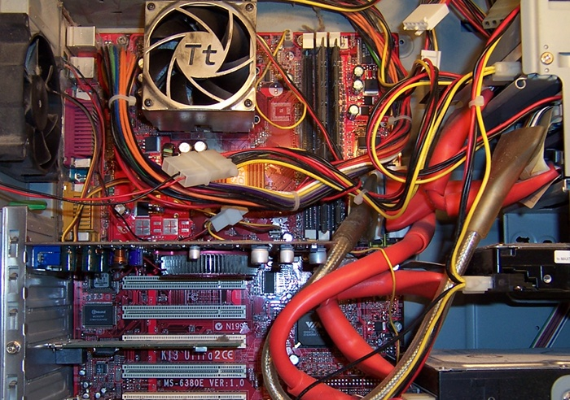

	
<html xmlns="http://www.w3.org/1999/xhtml" xml:lang="en" lang="en">

<head>
	<link rel="icon" type="image/png" href="display_logo.png" />
	<link rel='stylesheet' href='style.css' type='text/css' />
	<title>Philip Caldwell Consulting Services</title>
</head>

<body>

	
	<a href="home.html" style="background: #f89a3b;">Consulting Home</a>
	<a href="it.html">IT</a>
	<a href="automation.html">Automation</a>
	<a href="https://philipcaldwell.com/contact/">Contact</a>

	

		<h1>Welcome to Philip Caldwell Consulting Services</h1>
	

	

		

			IT Consulting
		

		

			Industrial Automation Consulting
		

		

			Hourly Rate: $60/Hr
		

	

	

		

			For posterity, my first custom PC build.  
			
		

	

	

		Hours: By appointment only 
		<a href="https://philipcaldwell.com/contact/">Call/Email</a> to schedule an appointment
	

	

		<a href="https://philipcaldwell.com/contact/">Call/Email</a> to schedule an appointment 
		&copy; Philip Caldwell 2022
	

</body>

</html>
